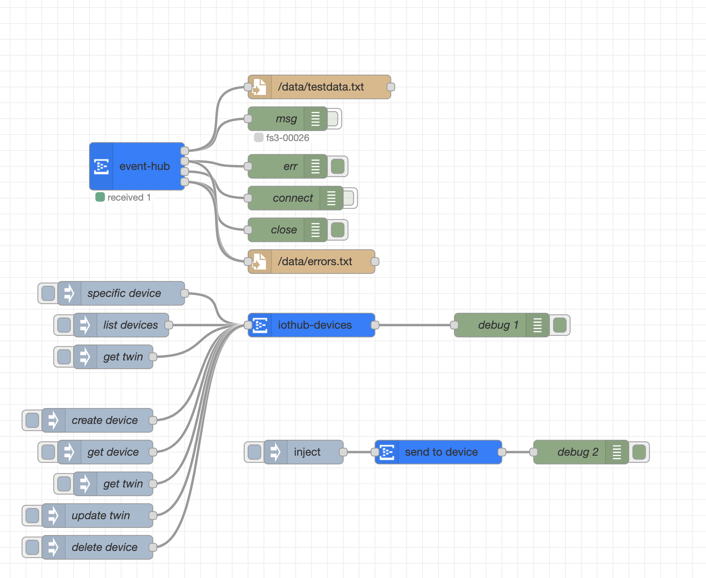

# node-red-contrib-azure-iothub-service


## Installation

```
npm install -g node-red-contrib-azure-iothub-service
```

# Usage

### eventhub-recv
Receive messages sent from devices via the builtin Event Hub.

### iothub-send
Send cloud2device messages to your IoT Hub devices.

### iothub-registry
Manage IoT Hub Devices.


<h4>List devices:</h4>
<code>method: <b>"device"</b></code>
<h4>Get device:</h4>
<code>method: <b>"device"</b>, deviceId: str</code>
<h4>Create device:</h4>
<code>method: <b>"device.create"</b>, deviceId: str</code>

<div>
<b>payload (optional):</b>
<div>
    <code>
        {
            status: 'enabled',
            authentication: {
                x509Thumbprint: { primaryThumbprint: XXX, secondaryThumbprint: XXX }
            }
        }
    </code>
</div>
</div>
<h4>Get twin:</h4>
<code>method: <b>"twin"</b>, deviceId: str</code>
<h4>Update twin:</h4>
<code>method: <b>"twin.update"</b>, deviceId: str</code>

<div>
<b>payload:</b>
<div>
    <code>
        {
            tags: { city: "Redmond" },
            properties: {
                desired: { telemetryInterval: 1000 },
            }
        }
    </code>
</div>
</div>
<h4>Delete device:</h4>
<code>method: <b>"device.delete"</b>, deviceId: str</code>

<h4>List <a href="https://learn.microsoft.com/en-us/javascript/api/azure-iothub/configuration?view=azure-node-latest">configurations</a>:</h4>
<code>method: <b>"config"</b></code>
<h4>Create configuration:</h4>
<code>method: <b>"config.create"</b></code>

<div>
<b>payload:</b>
<div>
    <code>
        {
            id: 'chiller4000x',
            content: {
                deviceContent: {
                    'properties.desired.chiller-water': {
                        temperature: 66,
                        pressure: 28
                    }
                }
            },
            metrics: {
                queries: {
                    waterSettingsPending: "SELECT deviceId FROM devices WHERE properties.reported.chillerWaterSettings.status='pending'"
                }
            },
            targetCondition: "properties.reported.chillerProperties.model='4000x'",
            priority: 20
        }
    </code>
</div>
<h4>Get configuration:</h4>
<code>method: <b>"config"</b>, configId: str</code>
<h4>Update configuration:</h4>
<code>method: <b>"config.update"</b>, configId: str</code>

<div>
<b>payload:</b>
<div>
    <code>
        {
            content: {
                deviceContent: {
                    'properties.desired.chiller-water': {
                        pressure: 29
                    }
                }
            }
        }
    </code>
</div>
</div>

<h4>Delete configuration:</h4>
<code>method: <b>"config.delete"</b>, configId: str</code>


## other functionality
 - checkpoint store
    - validate NodeRedCheckpointStore
    - local file checkpoint store (could use contextstore = localfilesystem)
    - Azure Blob backed store
 - generate certs
    - https://github.com/Azure/azure-iot-hub-node/blob/main/samples/create_device_with_cert.js

### lower-priority
 - device methods: 
    - https://github.com/Azure/azure-iot-hub-node/blob/main/samples/dmpatterns_reboot_service.js
    - https://github.com/Azure/azure-iot-hub-node/blob/main/samples/dmpatterns_fwupdate_service.js
    - https://github.com/Azure/azure-iot-hub-node/blob/main/samples/invoke_command.js
    - https://github.com/Azure/azure-iot-hub-node/blob/main/samples/invoke_component_command.js
    - https://github.com/Azure/azure-iot-hub-node/blob/main/samples/module_method.js
 - file notification
    - https://github.com/Azure/azure-iot-hub-node/blob/main/samples/receive_file_notifications.js
 - jobs
    - https://github.com/Azure/azure-iot-hub-node/blob/main/samples/job_query.js
    - https://github.com/Azure/azure-iot-hub-node/blob/main/samples/schedule_job.js

### even lower priority
 - bulk blob import export
    - https://github.com/Azure/azure-iot-hub-node/blob/main/samples/registry_bulk_import_sample.js
    - https://github.com/Azure/azure-iot-hub-node/blob/main/samples/registry_bulk_export_sample.js
    - https://github.com/Azure/azure-iot-hub-node/blob/main/samples/registry_bulk_sample.js
    - https://github.com/Azure/azure-iot-hub-node/blob/main/samples/registry_import_managed_identity_sample.js
    - https://github.com/Azure/azure-iot-hub-node/blob/main/samples/registry_export_managed_identity_sample.js
 - device modules
    - https://github.com/Azure/azure-iot-hub-node/blob/main/samples/module_sample.js
 - token credentials
    - https://github.com/Azure/azure-iot-hub-node/blob/main/samples/send_c2d_message_with_token_credential.js
    - https://github.com/Azure/azure-iot-hub-node/blob/main/samples/create_device_with_token_credential.js
 - digital twin client (already accomplished with registry afaict)
    - https://github.com/Azure/azure-iot-hub-node/blob/main/samples/update_digital_twin.js
 - edge deployment
    - https://github.com/Azure/azure-iot-hub-node/blob/main/samples/edge_deployment_sample.js